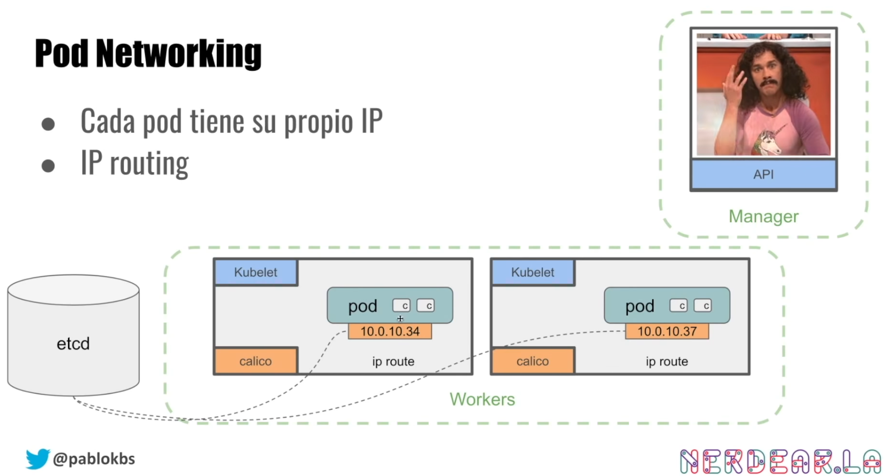

# Activity 4 - K8s Networking - K8s Services: ClusterIP, NodePort and LoadBalancer

## K8s Networking

As is explained in the [YouTube video](https://www.youtube.com/watch?v=DCoBcpOA7W4), the K8s networking is based this main ideas:

* A K8s cluster runs a CNI (Container Network Interface) plugin. This plugin is responsible for setting up the network for the cluster. The most common CNI plugins are Calico, Flannel, Weave Net, Cilium, etc.
* The CNI is responsible to assign an IP address to each pod. This IP address is reachable from any other pod in the cluster.



## K8s Services

K8s Services are managed by kube-proxy. The kube-proxy is a network proxy that runs on each node in the cluster. It maintains network rules on nodes. These network rules allow network communication to your Pods from network sessions inside or outside of your cluster.

There are 3 main types of Services:

* __ClusterIP__: Exposes the Service on a cluster-internal IP. Choosing this value makes the Service only reachable from within the cluster. This is the default ServiceType. You don't need to know the IP address of the Pod to communicate with it, and you know that the Service will always be reachable from the same IP address.
* __NodePort__: Exposes the Service on each Node's IP at a static port (the NodePort). A ClusterIP Service, to which the NodePort Service routes, is automatically created. You'll be able to contact the NodePort Service, from outside the cluster, by requesting `<NodeIP>:<NodePort>`.
* __LoadBalancer__: Exposes the Service externally using a cloud provider's load balancer. NodePort and ClusterIP Services, to which the external load balancer routes, are automatically created.

## Activities with K8s Services

The following activities will be using a Pod with Ubuntu in order to have the internal point of view of the cluster. The Pod will be created using the following yaml file, called `04-ubuntu-pod.yaml`:

```yaml
apiVersion: v1
kind: Pod
metadata:
  name: ubuntu
spec:
  containers:
  - name: ubuntu
    image: nicolaka/netshoot
    args:
    - sleep
    - infinity
```

So we can create the Pod using `kubectl apply -f 04-ubuntu-pod.yaml` and check the status using `kubectl get pods`.

### ClusterIP

The ClusterIP is the default ServiceType. So, if we create a Service without specifying the ServiceType, the Service will be created as ClusterIP.

The following yaml file, called `04-svc-clusterip.yaml`, will create a Service with the default ServiceType (ClusterIP):

```yaml
apiVersion: apps/v1
kind: Deployment
metadata:
  name: hello
spec:
  replicas: 3
  selector:
    matchLabels:
      role: hello # this is important for the Service selector
  template:
    metadata:
      labels:
        role: hello # this is important for the Service selector
    spec:
      containers:
      - name: hello
        image: gcr.io/google-samples/hello-app:1.0
        ports:
        - containerPort: 8080

---
apiVersion: v1
kind: Service
metadata:
  name: hello
spec:
  ports:
  - port: 8080
    targetPort: 8080
  selector:
    role: hello
```

We can create the Service using `kubectl apply -f 04-svc-clusterip.yaml` and check the status using `kubectl get svc`.

```bash
[vagrant@k8s-master ~]$ kubectl describe svc
Name:              hello
Namespace:         default
Labels:            <none>
Annotations:       <none>
Selector:          role=hello
Type:              ClusterIP
IP Family Policy:  SingleStack
IP Families:       IPv4
IP:                10.103.95.25
IPs:               10.103.95.25
Port:              <unset>  8080/TCP
TargetPort:        8080/TCP
Endpoints:         192.168.109.66:8080,192.168.140.65:8080,192.168.140.66:8080
Session Affinity:  None
Events:            <none>
```

So as we can see in the previous output, the Service has an IP address. And is possible to see how it works and K8s will redirect to different Pods using the following command `watch curl http://IP:PORT` from the Ubuntu Pod `kubectl exec -it ubuntu -- bash`.`


### NodePort

The NodePort ServiceType is used to expose the Service on each Node's IP at a static port (the NodePort). A ClusterIP Service, to which the NodePort Service routes, is automatically created. You'll be able to contact the NodePort Service, from outside the cluster, by requesting `<NodeIP>:<NodePort>`. You can use any node, K8s with KubeProxy will redirect the traffic to the correct Pod.

The following yaml file, called `04-svc-nodeport.yaml`, will create a Service with the ServiceType NodePort:

```yaml
apiVersion: apps/v1
kind: Deployment
metadata:
  name: hello
spec:
  replicas: 3
  selector:
    matchLabels:
      role: hello
  template:
    metadata:
      labels:
        role: hello
    spec:
      containers:
      - name: hello
        image: gcr.io/google-samples/hello-app:1.0
        ports:
        - containerPort: 8080

---
apiVersion: v1
kind: Service
metadata:
  name: hello
spec:
  type: NodePort
  ports:
  - port: 8080
    targetPort: 8080
    nodePort: 30000
  selector:
    role: hello
```

We can create the Service using `kubectl apply -f 04-svc-nodeport.yaml` and check the status using `kubectl get svc`. If the previous activity is still running, K8s will reconfigure the Service to use a NodePort.

After of that, we can point to any IP:NodePort and we will be redirected to the correct Pod. We can use the following command `watch curl http://IP:PORT` from the Ubuntu Pod `kubectl exec -it ubuntu -- bash` to check how it works. Or directly from the web browser using `http://IP:PORT`. If you don't know wich IP is using any of the nodes, you can use `kubectl get nodes -o wide` to check the IP address of each node.


### LoadBalancer (TODO)

As is explained in the [YouTube video](https://www.youtube.com/watch?v=DCoBcpOA7W4), the LoadBalancer ServiceType is used to expose the Service externally using a cloud provider's load balancer. NodePort and ClusterIP Services, to which the external load balancer routes, are automatically created.

__Problem__: In this case, we are using a Vagrant/VirtualBox environment, so we need to adapt the LoadBalancer ServiceType to our environment. We can use the [MetalLB](https://metallb.universe.tf/) project to do that. __MetalLB__ is a load-balancer implementation for bare metal Kubernetes clusters, using standard routing protocols.

TODO: Adapt the LoadBalancer ServiceType to our environment using MetalLB. Currently, MetalLB has been tested in the cluster, but is not working properly.